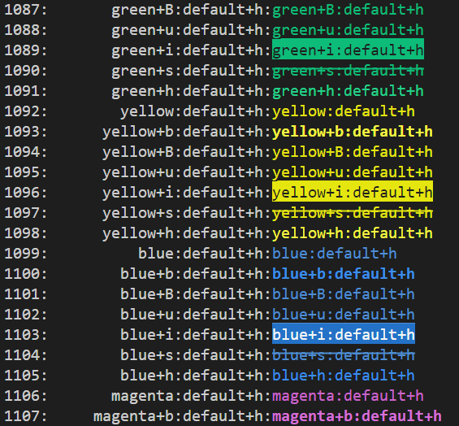

# *Trice* Tags and Color

> *Trice* is usable without tags and color similar to printf also.
<!-- vscode-markdown-toc -->
* 1. [How to get](#Howtoget)
	* 1.1. [Output options](#Outputoptions)
	* 1.2. [Check Alternatives](#CheckAlternatives)
* 2. [Color issues under Windows](#ColorissuesunderWindows)

<!-- vscode-markdown-toc-config
	numbering=true
	autoSave=true
	/vscode-markdown-toc-config -->
<!-- /vscode-markdown-toc -->

##  1. How to get

* Add a tag name as color descriptor in front of each `TRICE` format string like `"wrn:Peng!"`.
* In file [../internal/emitter/lineTransformerANSI.go](../internal/emitter/lineTransformerANSI.go) the colors are changeable and additional color tags definable.
* It is possible to concatenate single colorized letters to get output like this:

* [../_test/testdata/triceCheck.c](../_test/testdata/triceCheck.c) contains the code for this example.
* The **trice** tool, if knowing `wrn:` as pattern, prepends the appropriate color code. It removes the sequence `wrn:`, if it is known and completely lower case.
* The user can define any pattern with any color code to create colored output with the **trice** tool.
* There is no tag enable switch inside the target code. It would need a back channel and add overhead.
  * An option using tag specific ID range assignment exists. See closed issue [#243](https://github.com/rokath/trice/issues/243).
* The **trice** tool offers the 2 command line switches `-pick` and `-ban` to control tag visualization during runtime.  

###  1.1. Output options

###  1.2. Check Alternatives

There are over 1000 possibilities:

Only file [../internal/emitter/lineTransformerANSI.go](../internal/emitter/lineTransformerANSI.go) needs to be changed and the **trice** tool needs to be rebuild afterwards: `go install ./...`.
##  2. Color issues under Windows

**Currently console colors are not enabled by default in Win10**, so if you see no color but escape sequences on your powershell or cmd window, please refer to [Windows console with ANSI colors handling](https://superuser.com/questions/413073/windows-console-with-ansi-colors-handling/1050078#1050078) or simply use a Linux like terminal under windows, like git-bash. One option is also to install Microsoft *Windows Terminal (Preview)* from inside the Microsoft store and to start the **trice** tool inside there. Unfortunately this can not be done automatically right now because of missing command line switches. [Alacritty](../third_party/alacritty/ReadMe.md) is one of other alternatives.
